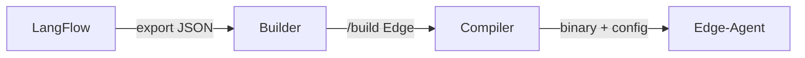

# Edge‑Agent 6 — Client Desktop Runner

> **Version 6.4 – 14 mai 2025**
> Aligné sur *Pivot LangFlow → Builder maison* (ActivePieces devient **\[OBSOLETE – remplacé par Builder]**).
> 🖥️ *Scénario B* : stack **Builder cloud** (flows JSON + Compiler) et **Edge‑Agent local** (LLM local via llama‑cpp). L’agent reçoit son binaire signé depuis Builder puis exécute les prompts en local.

---

## 1. Chaîne de valeur



---

## 2. Pré‑requis

| Élément               | Valeur / URL                             |
| --------------------- | ---------------------------------------- |
| UI Builder            | `http://localhost:41<idx>`               |
| Header auth           | `X-Api-Key: $env:BLD_KEY`                |
| Edge‑Launcher binaire | `edge_setup.exe` (signé, SHA‑256 validé) |

---

## 3. Install Edge‑Launcher (PowerShell)

```yaml
- cmd: .\\edge_setup.exe /silent TOKEN=<jwt> STACK_PORT=41<idx>
  path: C:\projets\agent-ai\edge
  venv: off
```

---

## 4. Déploiement & premier « hello »

1. Dans **Console Admin UI Builder** : cliquez **Build Edge** sur le flow voulu.
2. Le Compiler empaquette `flow_<id>.py` + runtime, génère le binaire, puis
   pousse l’artefact signé vers le bucket tenant.
3. L’Edge‑Launcher télécharge le binaire à la prochaine heartbeat (30 s).
4. Vérifiez dans `logs/edge-agent.log` la ligne : `Flow <id> ready – runner started`.

---

## 5. Observabilité OTEL

| Champ        | Valeur               |
| ------------ | -------------------- |
| `tenant`     | slug client          |
| `stack_port` | `41<idx>`            |
| `runner_id`  | SHA‑1(flowID + host) |

---

## 6. Checklist fin de phase 6

* [ ] `edge_setup.exe` téléchargé et installé silencieusement.
* [ ] Binaire Edge signé (flow) apparaît dans bucket `tenant/<slug>/edge/`.
* [ ] Tag OTEL `stack_port:41<idx>` remonté dans Phoenix.
* [ ] Latence prompt → réponse < 6 s sur Mistral‑7B‑Q8.

---

## 📝 Changelog

| Version | Date       | Motif                                             |
| ------- | ---------- | ------------------------------------------------- |
| 6.4     | 2025-05-14 | Pivot complet vers Builder (ports, UI, variables) |
| 6.3     | 2025-05-10 | Support binary signed deployment                  |
