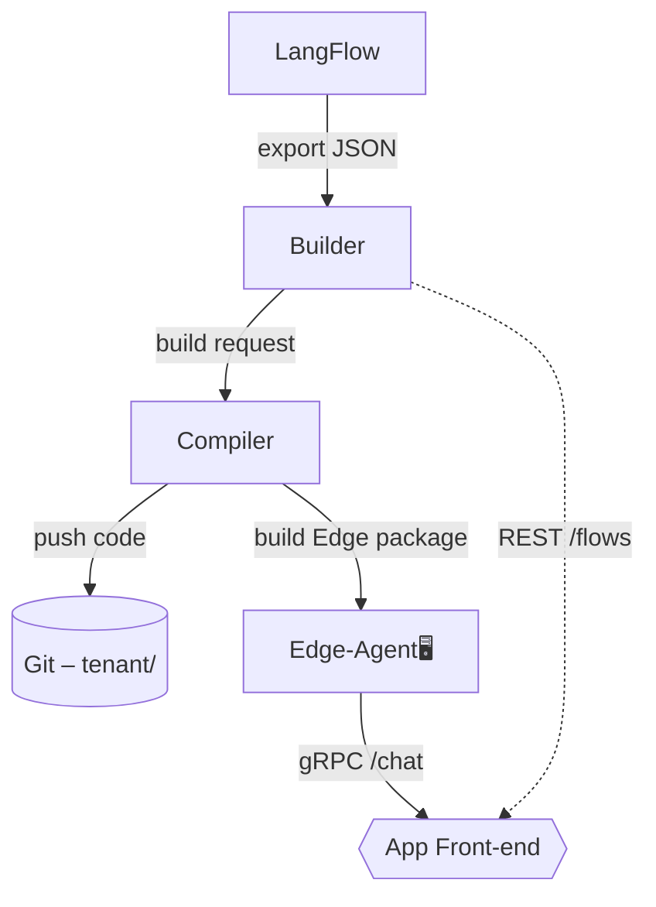

# Phase 5 — Lego‑studio étendu : Cloud / Desktop dual‑target

> **Version 5.4 – 14 mai 2025**
> Aligné sur *Pivot LangFlow → Builder maison* (ActivePieces devient **\[OBSOLETE – remplacé par Builder]**).
> 🎯 *Objectif :* pour chaque client, disposer d’une **stack Builder cloud** (flows JSON, Compiler Python, exécution LLM 🡒 OpenAI/Mistral) ***et*** d’un **Edge‑Agent local** (LLM local via llama‑cpp, private data).

---

## 1. Chaîne de valeur & périmètre



> *Image mentale* : LangFlow est l’**atelier LEGO** qui crée les briques, Builder la **table à dessin** où l’on assemble le circuit, Compiler la **presse d’imprimerie**, Edge‑Agent la **valise** que l’on emmène hors‑ligne.

---

## 2. Pré‑requis

| Élément           | Valeur / URL                          | Commentaire                      |
| ----------------- | ------------------------------------- | -------------------------------- |
| UI **Builder**    | `http://localhost:41<idx>`            | Port adopté depuis phase 4B      |
| Endpoint `/flows` | `GET /flows`, `POST /flows/:id/run`   | Header `X‑Api‑Key: $env:BLD_KEY` |
| Endpoint `/build` | `POST /build` (Compiler)              | même header                      |
| Repository Git    | `github.com/org/builder‑stack‑<slug>` | PAT stocké dans Vault            |
| Edge‑Agent image  | `ghcr.io/org/edge‑agent:latest`       | packagée par Compiler            |

---

## 3. Architecture déployée

```
┌──────────────────────── Cloud (Docker‑compose – stack client) ─────────────────────┐
│                                                                                    │
│  ┌──────────┐      REST                        ┌──────────┐    Git push             │
│  │ Builder  │ ──────────────▶ Compiler ───────▶│  Git     │───▶ repo tenant        │
│  └──────────┘                                  └──────────┘                       │
│        ▲                                             │                            │
│        │ gRPC                                        │ build Edge pkg             │
│        │                                             ▼                            │
│    App Front‑end ◀────────────────────── Edge‑pkg (tar.gz)                         │
│                                                                                    │
└────────────────────────────────────────────────────────────────────────────────────┘
        ▲
        │ ssh / rsync
        ▼
┌──────────── Desktop / On‑prem ───────────┐
│ Edge‑Agent (LLM local, LangServe)        │
└──────────────────────────────────────────┘
```

---

## 4. Processus détaillé

1. **Import du flow** : l’utilisateur conçoit le flow dans LangFlow puis clique **Export JSON**.
2. **Upload vers Builder** : `builder-cli import --file hello.flow.json`.
3. **Compilation Cloud** : Builder appelle `POST /build` avec `flow_id` ; Compiler génère `flow_<id>.py` + `runner_<id>.py`, pousse sur Git (branche `tenant/<slug>`).
4. **Paquet Edge** : Compiler crée une archive `edge_pkg_<id>.tar.gz` contenant code + modèles quantisés.
5. **Déploiement Desktop** : archive transférée via `scp` ou API controleur ; Edge‑Agent charge le nouveau pipeline et redémarre LangServe.
6. **Exécution** : Front‑end appelle `Builder /flows/:id/run` pour Cloud, ou Edge‑Agent gRPC `/chat` en local.

---

## 5. Quotas & observabilité

| Garantie                 | Implémentation                                             |         |
| ------------------------ | ---------------------------------------------------------- | ------- |
| **Quota builds**         | 100 builds / 24 h / client / cible (Cloud **ou** Edge)     |         |
| **Trace OTEL**           | `stack_port:41<idx>`, `tenant:<slug>`, \`target:{cloud     | edge}\` |
| **Idempotence Compiler** | SHA‑256 (flow JSON) + timestamp minute ; skip si identique |         |
| **Alertes**              | Prometheus alert `edge_agent_last_sync_seconds > 7200`     |         |

---

## 6. Checklist fin de phase 5

* [ ] `builder-cli export --id <id>` génère archive Edge sur demande.
* [ ] Git repo branche `tenant/<slug>` reçoit commit `<flow_id>` + tag `v1.0.<patch>`.
* [ ] Edge‑Agent chargé et opérationnel sur desktop de test.
* [ ] Spans `edge_build`, `edge_deploy`, `edge_chat` visibles dans Phoenix.
* [ ] Quota et alertes Prometheus activés.

---

## 7. 📝 Changelog

| Version | Date       | Motif                                                                              |
| ------- | ---------- | ---------------------------------------------------------------------------------- |
| **5.4** | 2025‑05‑14 | Pivot complet vers **Builder** (ports, diagramme, pré‑requis, variables)           |
| 5.3     | 2025‑05‑10 | Mise à jour quotas Edge + Cloud \[OBSOLETE – remplacé par Builder]                 |
| 5.2     | 2025‑05‑08 | Ajout diagramme mermaid initial \[OBSOLETE – remplacé par Builder]                 |
| 5.1     | 2025‑05‑05 | Première structure Phase 5 avec ActivePieces CE \[OBSOLETE – remplacé par Builder] |
