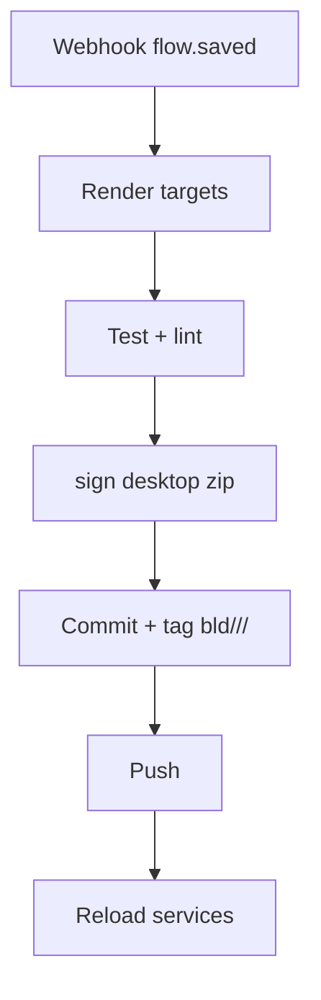

# Phase 5 — Lego‑studio étendu : Cloud / Desktop dual‑target

> **Version 5.3 – 10 mai 2025**
> Aligné sur *Pivot LangFlow → ActivePieces* et *Scénario B : 1 stack ActivePieces CE cloud + Edge‑Agent local*.
> 🧱 **1 stack = 1 client** – La chaîne devient : **LangFlow** (design) ➜ **ActivePieces** (flow\.saved) ➜ **Compiler Service** qui produit :
>
> 1. un **Cloud Agent** Python exécuté par LangServe dans la stack Docker ;
> 2. un **Edge‑Agent** (bundle signé) qui tourne sur le PC du client pour automatiser l’OS.

---

## Sommaire

1. Rappel des objectifs Phase 5
2. Architecture dual‑target
3. Pipeline build & quota
4. Stratégie Git **par client**
5. Contrôles qualité
6. Préparer Phase 6 (sécurité & distribution)
7. Risques & mitigations
8. Observabilité
9. Changelog

> 📌 **Note chemins** : toute commande est lancée **depuis** `compose/<slug>` (ou dans le conteneur *compiler* de la même stack). Les artefacts Desktop sont rangés dans `desktop/<slug>/`. Le design reste dans **LangFlow** (`http://localhost:78<idx>`).

---

## 1. Rappel des objectifs Phase 5

* Ajouter la cible **Edge‑Agent** en plus du Cloud Agent Python.
* Conserver la source unique de vérité : **flow JSON exporté depuis LangFlow puis importé** dans ActivePieces.
* Normaliser les métriques OTEL (cloud vs desktop).
* Mettre en place quota build & signature pour la distribution sécurisée.

---

## 2. Architecture dual‑target

```mermaid
graph TD
    subgraph Design
        L[LangFlow] -->|export JSON| AP[ActivePieces]
    end
    subgraph Compiler Service
        AP --> W[flow.saved webhook]
        W --> B{target}
        B -->|Cloud| C[Render flow.py + runner]
        B -->|Desktop| D[Render edge bundle (zip signé)]
    end
    C --> E[pytest]
    D --> F[sign + checksum]
    E & F --> G[git commit & push]
    G --> H[reload langserve / notify edge-launcher]
    H --> I((Phoenix))
```

### Manifest (edge bundle)

| Champ          | Exemple                            | Description                           |
| -------------- | ---------------------------------- | ------------------------------------- |
| `edge_url`     | `https://bucket/edge_acme_1.0.zip` | Lien de téléchargement                |
| `sha256`       | `3a4e…`                            | Intégrité                             |
| `cpu_arch`     | `x86_64`                           | Compatibilité PC                      |
| `edge_runtime` | `autohotkey`                       | Moteur utilisé (pywinauto, AHK, etc.) |
| `version`      | `1.0.0`                            | Sémantique bundle                     |

---

## 3. Pipeline build & quota



* **Quota** : **100 builds / 24 h / client / cible**.
* **Tags OTEL** : `stack_port:31<idx>`, `agent_type:cloud|edge`.

### 3.4 Génération artefact Edge

```yaml
- cmd: python compiler/build_edge.py --slug <slug> --ver 1.0.0
  path: C:\projets\agent-ai\compose\<slug>
  venv: on
# ➜ Sortie : desktop/<slug>/edge_1.0.zip
```

### 3.6 Cloud ↔ Edge handshake

* Notification : `POST http://edge-launcher:8765/notify` (JSON manifest).
* Fallback gRPC : `edge-launcher.grpc:50051/Edge.Notify`.

---

## 4. Pré‑requis techniques

| Élément            | Valeur / URL                                                |
| ------------------ | ----------------------------------------------------------- |
| Atelier LangFlow   | `http://localhost:78<idx>` (design)                         |
| UI ActivePieces CE | `http://localhost:31<idx>` ou `http://ui.<slug>.domain.tld` |
| Phoenix            | Conteneur `phoenix` démarré                                 |
| Dossier courant    | `C:\projets\agent-ai\compose\<slug>`                        |
| Branche Git        | `tenant/<slug>`                                             |

---

## 5. Stratégie Git par client

* **Branche unique** : `tenant/<slug>`.
* **Hook pré‑commit** : refuse fichiers hors `agent-ai/<slug>/`, `desktop/<slug>/`, `app/flows/<slug>/`.
* **Purge hebdo** : script `purge_build_tags.ps1` supprime tags `bld/<slug>` > 30 j.
* **Audit** : Phoenix span `build.reject.quota` taggé `stack_port`.

---

## 6. Contrôles qualité

| Cible   | Tests                                                            | Outils         |
| ------- | ---------------------------------------------------------------- | -------------- |
| Cloud   | `pytest`, TruLens ≥ 0.6, Guardrails Colang                       | CI GitHub      |
| Desktop | `pytest-playwright` headless, antivirus scan, signature vérifiée | Runner Windows |

Checklist sortie Phase 5 :

* [ ] Build Cloud OK, latence < 500 ms.
* [ ] Edge‑Agent téléchargé et exécute un script de démo (*Notepad* ouvert/fermé).
* [ ] Quota & tags OTEL en place (cloud + edge).

---

## 7. Préparer Phase 6 (sécurité & distribution)

* Créer bucket **`edge-artifacts`** (IAM download‑only).
* Pipeline de **signature** : `signtool` Windows ou `codesign` macOS.
* Ajouter auto‑update : cycle 24 h depuis bucket ; checksum SHA‑256.

---

## 8. Risques & mitigations

| Risque                      | Impact                       | Mitigation                    |
| --------------------------- | ---------------------------- | ----------------------------- |
| Surquota builds             | Dépassement coût LLM/compute | Quota + back‑off 10 min       |
| Malware bundle              | Compromission PC client      | Signature + antivirus scan CI |
| Divergence Cloud vs Desktop | Incohérences résultats       | Tests snapshot contract       |

---

## 9. Observabilité

* Spans `agent.cloud.*` & `agent.edge.*` (tags `agent_type`).
* Dashboard Grafana filtré `stack_port`.
* Alertes Slack DevOps si quota dépassé.

---

## 📝 Changelog

| Version  | Date       | Motif                                                                                                                               |
| -------- | ---------- | ----------------------------------------------------------------------------------------------------------------------------------- |
| **v5.3** | 2025-05-10 | Ajout référence **LangFlow** comme source design ; mise à jour architecture & pré‑requis ; sommaire restructuré ; quotas inchangés. |
| v5.2     | 2025-05-10 | Dual‑target clarifié Cloud / Desktop, ajout dossier `desktop/<slug>`, tags `agent_type`, champ `cpu_arch`.                          |
| v5.1     | 2025-05-10 | Alignement Scénario B initial (stack isolée).                                                                                       |
| v5       | 2025-05-07 | Dual‑target conception initiale, quota build.                                                                                       |
| v4       | 2025-05-05 | Première version Lego‑studio.                                                                                                       |
