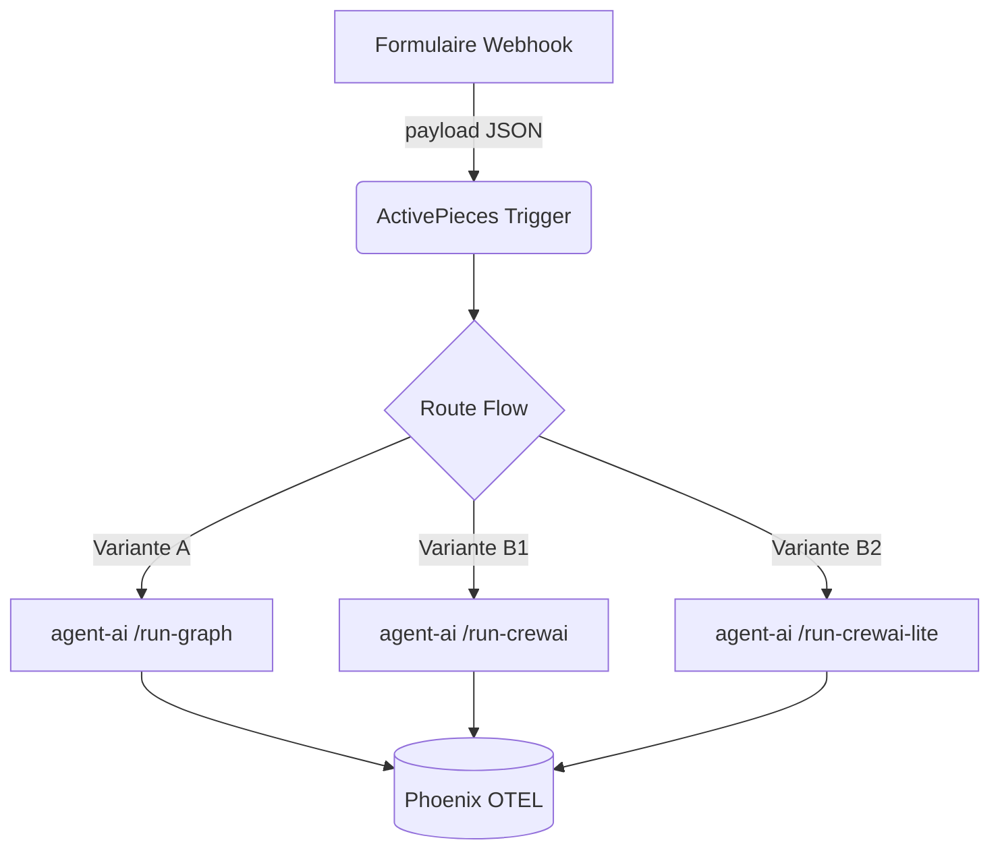
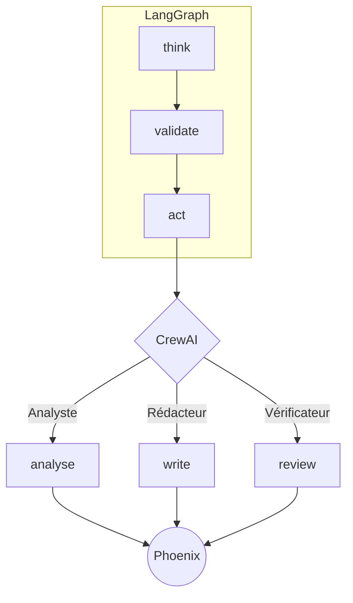

# workflows.md

> **Version 2 – 7 mai 2025**
> Ce document sert de **mémo visuel** : pour chaque sprint, il montre *comment* les blocs s’enchaînent (diagramme) et *où copier‑coller* les commandes clés. Les métaphores chantier restent dans `00_explications_imagé.md` pour garder ce fichier 100 % opérationnel.

---

## 🔖 Sommaire

* [Sprint 4A – Déclencheurs ActivePieces #S4A\_ui](#s4a)
* [Sprint 4B – Orchestration CrewAI / LangGraph #S4B\_agents](#s4b)
* [Exemple d’application PDF → Odoo](#exemple)
* [Templates & Chemins](#templates)
* [Changelog](#changelog)

---

## 🟢 Sprint 4A – Déclencheurs ActivePieces #S4A\_ui

### Diagramme Mermaid



### Commandes YAML “ready to copy”

```yaml
- cmd: ap import --file templates/variante_A.flow.json
  path: C:\projets\agent-ai\external\activepieces
  venv: off
- cmd: docker compose up -d activepieces-ui
  path: C:\projets\agent-ai
  venv: off
```

*Rappel : démarrer ******************phoenix****************** avant l’UI pour tracer les webhooks.*

---

## 🟠 Sprint 4B – Orchestration multi‑agents #S4B\_agents

### Diagramme Mermaid (LangGraph + CrewAI)



### Commandes YAML

```yaml
- cmd: python -m app.agent_ai.graph_runner --trace true
  path: C:\projets\agent-ai
  venv: on
- cmd: crewai run --config configs/crew_s4b.yaml
  path: C:\projets\agent-ai
  venv: on
```

*Les spans OTEL seront collectés par Phoenix.*

---

---

## 🧩 Templates & Chemins pas encore cree

| Variante | Template ActivePieces              | Endpoint backend   | Doc implémentation    |
| -------- | ---------------------------------- | ------------------ | --------------------- |
| A        | `/templates/variante_A.flow.json`  | `/run-graph`       | « workflows.md » §A   |
| B‑1      | `/templates/variante_B1.flow.json` | `/run-crewai`      | « workflows.md » §B‑1 |
| B‑2      | `/templates/variante_B2.flow.json` | `/run-crewai-lite` | «workflows.md » §B‑2  |
| C        | `/templates/variante_C.flow.json`  | `/run-auto`        | « workflows.md » §C   |

*Table d’origine conservée, simplement re‑ancrée ici.* citeturn20file19

---

## 📝 Changelog

| Version | Date       | Motif                                                                                                   |
| ------- | ---------- | ------------------------------------------------------------------------------------------------------- |
| **v2**  | 2025‑05‑07 | Nettoyage métaphores supprimées, ajout Sprint 4A/4B (diagrammes, YAML), sommaire cliquable, tag sprint. |
| v1      | 2025‑05‑01 | Première ébauche (templates variante A/B/C).                                                            |

---

*Ce fichier est un mémo : ajoute un nouveau diagramme ou une commande YAML dès qu’un workflow est validé.*

# 📚 Blueprints visuels – Deux maîtres, trois offres

> **Deux mondes SaaS :**
>
> 1. ⚙️ **Automatisation réglementée** → *LangGraph maître* (Variante A)
> 2. 🫂 **Collaboration experte** → *CrewAI maître* (Variantes B‑1 & B‑2)
>
> Le client choisit son camp ; l’IA de secours (Variante C) reste toujours disponible pour les workflows 100 % scripts.

---

## ⚙️ Variante A — **LangGraph maître** (Automatisation réglementée)

```text
(UI) ─► Router
      │
      ▼
┌────────────────────────────┐
│ Node think_plan  (LLM)     │
└────────────────────────────┘
      │
      ▼
┌────────────────────────────┐
│ Node retrieve_context      │
│ • LlamaIndex.as_retriever()│
│ • ↔ Chroma vecteurs        │
└────────────────────────────┘
      │
      ▼
┌────────────────────────────┐
│ Node validate  (CrewAI)    │
└────────────────────────────┘
      │
      ▼
┌────────────────────────────┐
│ Node act  (Tools / MCP)    │
└────────────────────────────┘
```

*Le **tableau électrique** cadence tout ; la salle de réunion CrewAI n’intervient qu’au contrôle qualité.*

### ▼ Schéma détaillé Variante A

```text
(UI ‑ ActivePieces) ─► RouterChain
      │               (intent, langue)
      │
      ▼
┌───────────────┐  Feature Flag
│ Guardrails    │◄─────────────── ConfigCat("strict_mode")
└───────────────┘
      │
      ▼
┌────────────────────────────┐
│ think_plan (LLM GPT‑4 /    │
│           Llama‑3)         │
│ • charge prompts système   │
│ • plan des étapes          │
└────────────────────────────┘
      │   context.plan
      ▼
┌────────────────────────────┐
│ retrieve_context           │
│ • LlamaIndex   top‑k=5     │
│ • filtres RGPD             │
└────────────────────────────┘
      │   docs
      ▼
┌────────────────────────────┐
│ transform_normalize (py)   │
│ • pandas clean             │
└────────────────────────────┘
      │ cleaned_data
      ▼
┌────────────────────────────┐
│ validate (CrewAI – roles)  │
│ • Auditor  • Legal         │
│ • Critic                   │
└────────────────────────────┘
      │   ok/error
      ├─────────────── error → CrewAI repair
      ▼
┌────────────────────────────┐
│ act (MCP : Browser / SQL)  │
└────────────────────────────┘
      │
      ▼
┌────────────────────────────┐
│ report_pdf + Phoenix trace │
└────────────────────────────┘
```

#### 🔍 Explications détaillées Variante A

* **RouterChain** : détecte la langue, le domaine légal, la taille des données. Redirige vers le bon prompt système.
* **Guardrails** : bloque d’emblée toute donnée sensible non autorisée (RGPD).
* **think\_plan** : prépare le plan d’action (analogue à un “ordre de mission”).
* **retrieve\_context** : va chercher les 5 documents les plus pertinents dans Chroma, grâce à Llama‑Index.
* **transform\_normalize** : nettoyage tabulaire (pandas) pour formats fiscaux exigeants.
* **validate** : CrewAI (Auditor, Legal, Critic) vérifie calculs, cohérence, signatures.
* **act** : scripte MCP Browser ou SQL pour dépôt officiel (ex. portail DGFiP).
* **report\_pdf** : archive WORM + trace OTEL pour audit 6 ans.

---

## 🫂 Variantes B — **CrewAI maître** (Collaboration experte)

### B‑1 : *Brainstorm* (≈ 90 % collaboration)

```text
(UI) ─► CrewAI (Planner, Researcher,
               Critic, Synthesizer… )
      │        │
      │        ├─► Débat continu & vote
      │        ▼
      ▼  sous‑tâche
┌────────────────────────────┐
│ Mini‑graphe LangGraph      │  (scrape → clean → vectorize)
└────────────────────────────┘
      │
      ▼
┌────────────────────────────┐
│ Synthèse (CrewAI)          │
└────────────────────────────┘
      │
      ▼
┌────────────────────────────┐
│ Rapport final  (PDF /Slack)│
└────────────────────────────┘
```

*La **table ronde** débat en continu ; chaque expert déclenche son propre mini‑tableau électrique.*

#### ▼ Schéma détaillé B‑1

```text
(UI) ─► CrewAI.run(task="Launch campaign")
            │ context.global_prompts
            ▼
┌────────────────────────────┐
│   Planner (Llama‑3‑32k)    │
│   • découpe projet         │
└────────────────────────────┘
            │ sub_tasks list
            ▼ parallel
┌──────────────┬──────────────┬──────────────┐
│ Researcher   │ Copywriter   │ Designer     │
│  – Google    │  – GPT‑4     │  – DALL·E    │
└──────────────┴──────────────┴──────────────┘
            │ merge results
            ▼
┌────────────────────────────┐
│ Critic + QA (agents)       │
│ – vote, RAG justification  │
└────────────────────────────┘
            │ approved_content
            ▼
┌────────────────────────────┐
│ Publish (LangGraph mini)   │
│ – CMS API, SEO check, etc. │
└────────────────────────────┘
```

##### 🔍 Explications détaillées B‑1

* **Planner** : découpe la campagne en sous‑tâches, choisit outils (SEO, visuel…).
* **Researcher** : collecte données marché (Google, PDF). Utilise un mini‑graphe de scraping.
* **Copywriter** : rédige le texte marketing en tonalité définie.
* **Designer** : génère l’image clé (DALL·E / Stable Diffusion).
* **Critic + QA** : vote multi‑critère, justifie via RAG, propose retouches.
* **Publish mini‑graphe** : appelle CMS API, vérifie balises SEO, publie.

---

### B‑2 : *Lite crew* (0‑20 % collaboration)

```text
(UI) ─► CrewAI (Executor seul)
      │
      ▼
┌────────────────────────────┐
│ Mini‑graphe LangGraph      │  (API → DB → Slack)
└────────────────────────────┘
      │
      ▼
┌────────────────────────────┐
│ Rapport / API out          │
└────────────────────────────┘
      │
(if error or flag review)
      ▼
┌────────────────────────────┐
│ Critic (CrewAI)            │
└────────────────────────────┘
```

#### ▼ Schéma détaillé B‑2

```text
Executor (GPT‑4‑Turbo)
   │ steps plan
   ▼
┌────────────────────────────┐
│ Step 1   call OpenWeather  │
└────────────────────────────┘
   │ ok
   ▼
┌────────────────────────────┐
│ Step 2   write to Notion   │
└────────────────────────────┘
   │ error → triggers Critic
   ▼
┌────────────────────────────┐
│ Critic agent asks user     │
└────────────────────────────┘
```

##### 🔍 Explications détaillées B‑2

* **Executor** : un seul agent polyvalent ; suit un plan linéaire.
* **Mini‑graphe** : exécute API, transformation, stockage sans débat.
* **Critic (optionnel)** : n’est appelé que si un pas échoue ou si `flag_review=true`.

---

### ▼ Schéma détaillé Variante C

```text
Dispatcher
   │ POST /browser-fill
   ▼
┌────────────────────────────┐
│ open_url                   │
└────────────────────────────┘
   │
   ▼
┌────────────────────────────┐
│ fill_fields (loop rows CSV)│
└────────────────────────────┘
   │
   ▼
┌────────────────────────────┐
│ submit & screenshot        │
└────────────────────────────┘
   │ status_code
   ├── 200 → Reporter
   └── !=200 → Diagnostician(CrewAI)
```s
## 🚚 Variante C — **Automation‑first + IA de secours**

### Schéma principal

```text
(ActivePieces) ─► Dispatcher HTTP
                   │ (flow_id, collab_mode="off")
                   ▼
                LangGraph « Automation »
                   │  Node act() → Scripts MCP (Playwright, API…)
                   │
          ┌── OK ──┴──────────────┐
          │                       ▼
          │                  Reporter
          │                  (Slack / PDF)
          │
          └─ KO / doute ─► CrewAI validate/repair
                             Agents: Diagnostician, Fixer, Analyst
```

### Schéma détaillé – pas‑à‑pas

| Ordre | Nœud                       | Outil pilote                            | Actions clés                                                                                                                                 | Points de vigilance                                                                                                      |
| ----- | -------------------------- | --------------------------------------- | -------------------------------------------------------------------------------------------------------------------------------------------- | ------------------------------------------------------------------------------------------------------------------------ |
| 1     | **Dispatcher**             | ActivePieces Custom Piece               | • Auth JWT <br>• Sélection du `flow_id` <br>• Paramètre `dry_run`                                                                            | S’assurer que le temps d’exécution HTTP ne dépasse pas 30 s (sinon utiliser webhook retour).                             |
| 2     | **act()**                  | **LangGraph** – nœuds 100 % scripts MCP | • `BrowserMCP.open_url()` <br>• `fill(selector,value)` <br>• `click()` <br>• Retry ×3, timeout 20 s                                          | Tokens LLM = 0 sauf si `needs_fallback=True`. Logs OTEL par action pour audit RGPD.                                      |
| 3     | **Reporter**               | WeasyPrint + Slack API                  | • Capture écran <br>• Génération PDF <br>• Post Webhook Slack                                                                                | Profondeur d’archivage configurable (6 ans fiscal, 10 ans médical).                                                      |
| 4     | **CrewAI validate/repair** | CrewAI (Agents) + GPT‑4o                | • `Diagnostician` : analyse stacktrace, DOM diff <br>• `Fixer` : propose correctif, teste en dry\_run <br>• `Analyst` : alerte humaine si KO | Ne se déclenche que si `state.error==True` ou `needs_human_reasoning` flag. Contrôle des coûts : \~30‑60 ¢ par incident. |

### Avantages

* **Ultra‑rapide** : 0 token quand tout va bien.
* **Économique** : CrewAI n’est payé qu’en cas de pépin.
* **Self‑service** : le client paramètre selectors & valeurs dans ActivePieces.

### Limites

* Captcha, MFA, DOM instable : exiger API tierce ou validation humaine.
* Observabilité moins verbeuse que Variante A : seules erreurs génèrent spans CrewAI.
* Maintenance sélecteurs à prévoir (contrat “Selector Care”).

> *Métaphore* : un **tapis roulant** clique sans relâche ; si un colis coince, la **concierge IA** enfile ses gants, répare, puis relance la chaîne.


# 🧭 Matrix de décision – Choisir son schéma d’orchestration

> **Objectif :** en 3 minutes, déterminer si un nouveau scénario doit adopter la Variante A, B‑1, B‑2 ou C.
>
> **Principe :** on répond à trois questions, on attribue un score, on lit la décision.

---

## 1️⃣ Questions rapides

| #      | Question                                                                             | Choix A (⚙️ Automatisation réglementée) | Choix B‑1 (🫂 Brainstorm 90 %) | Choix B‑2 (🚂 Lite crew) | Choix C (🚚 Automation‑first) |
| ------ | ------------------------------------------------------------------------------------ | --------------------------------------- | ------------------------------ | ------------------------ | ----------------------------- |
| **Q1** | **Traçabilité & conformité** <br>Besoin d’audit formel, piste d’audit, RGPD strict ? | **2 pts**                               | 0 pt                           | 1 pt                     | 1 pt                          |
| **Q2** | **Nature de la tâche** <br>Créative & discursive ou déterministe ?                   | 0 pt                                    | **2 pts**                      | 1 pt                     | **0 pt**                      |
| **Q3** | **Ratio scripts / IA** <br>> 80 % actions scripts répétitives ?                      | 1 pt                                    | 0 pt                           | 1 pt                     | **2 pts**                     |

> **Règle :** on choisit la variante qui obtient **le plus de points**. En cas d’égalité, voir section 2.

---

## 2️⃣ Égalité ? Affine avec ces critères secondaires

| Critère secondaire                                     | Favorise | Pourquoi                                             |
| ------------------------------------------------------ | -------- | ---------------------------------------------------- |
| **Budget tokens** < 0,50 € / run                       | B‑2 ou C | Agents désactivés → moins de LLM                     |
| **Latence** < 5 s attendue                             | C ou B‑2 | Pas de débat, prompts courts                         |
| **Storytelling produit** (marketing « dream‑team IA ») | B‑1      | Valeur perçue supérieure                             |
| **Index documentaire lourd / RAG hiérarchique**        | A        | LangGraph maître gère mieux les retrievers multiples |

---

## 3️⃣ Feuille de route Express

1. **Remplis Q1‒Q3** → calcule les points.
2. *Égalité ?* → regarde les critères secondaires et la priorité client (latence, coût, storytelling).
3. **Décision** : note dans l’issue Git « Variante retenue : A / B‑1 / B‑2 / C ».
4. **Créer un nouveau flow** dans ActivePieces en choisissant le template correspondant (dossier `/templates/variante_*`).

---

## 4️⃣ Exemple d’application

> **Cas :** « Générer un rapport juridique en multi‑langue à partir de 20 PDF et le déposer dans Odoo ».
>
> Réponses :
>
> * **Q1 :** Oui (audit) ⇒ A = 2 pts
> * **Q2 :** Collaboration moyenne (analyse & synthèse) ⇒ B‑1 = 2 pts
> * **Q3 :** 50 % scripts & 50 % IA ⇒ égalité A = 1 pt, B‑1 = 0 pt
>
> **Scores :** A = 3, B‑1 = 2, B‑2 = 1, C = 1 ⇒ **Variante A**.

---

## 5️⃣ Templates & Chemins

| Variante | Template ActivePieces              | Endpoint backend   | Doc d’implémentation  |
| -------- | ---------------------------------- | ------------------ | --------------------- |
| A        | `/templates/variante_A.flow.json`  | `/run-graph`       | « Blueprint.md » §A   |
| B‑1      | `/templates/variante_B1.flow.json` | `/run-crewai`      | « Blueprint.md » §B‑1 |
| B‑2      | `/templates/variante_B2.flow.json` | `/run-crewai-lite` | "Blueprint.md" §B‑2   |
| C        | `/templates/variante_C.flow.json`  | `/run-auto`        | "Blueprint.md" §C     |

---

> **Astuce mémotechnique**
>
> * **A = Audit**
> * **B‑1 = Brainstorm**
> * **B‑2 = Basic crew**
> * **C = Click‑bot avec parachute IA**

---

*Version : 2025‑05‑07 – Révision 1*

## Bonnes pratiques : organisation du code pour les agents et orchestrations

Ce tableau résume la structure recommandée pour maintenir un dépôt clair, réutilisable et facilement exposable au front (ActivePieces, webhook, etc.).

| Couche                | Contenu                                                                                                     | Exemple de dossier                 |
| --------------------- | ----------------------------------------------------------------------------------------------------------- | ---------------------------------- |
| **🧰 Outils**         | Fonctions LangChain Tools, wrappers d’API, prompts Jinja, modèles Pydantic.                                 | `app/components/`                  |
| **🧩 Flows / Graphs** | Un fichier **par orchestration** qui importe les outils et déclare les nœuds LangGraph ou les rôles CrewAI. | `app/flows/<nom_flow>.py`          |
| **🚀 Runners**        | Script CLI / endpoint FastAPI qui appelle `create_flow()` puis `.run(input)`.                               | `app/runners/<nom_flow>_runner.py` |

### Pourquoi cette séparation ?

* **Réutilisabilité** : les outils sont des LEGOs partagés entre plusieurs flows.
* **Lisibilité** : on ouvre `app/flows/mon_flow.py` et on voit immédiatement la logique métier, sans se perdre dans les détails techniques.
* **Tests unitaires** : un outil isolé se teste indépendamment du graph complet.
* **Exposition front** : ActivePieces (ou tout autre UI) peut lister les flows disponibles, afficher leurs entrées/sorties et déclencher le runner correspondant via HTTP.

### Bonnes pratiques supplémentaires

* **Factoriser** les prompts et helpers communs dans `app/components/`.
* **Versionner** vos flows (nom explicite ou tag Git) pour conserver l’historique.
* **Documenter** dans chaque flow la liste des outils qu’il consomme et les paramètres attendus.
* **Automatiser** la découverte : un script peut scanner `app/flows/` et enregistrer automatiquement les endpoints FastAPI / ActivePieces.

> *Image : Pensez au projet comme à une cuisine : les ingrédients (🧰) sont au garde‑manger, la recette (🧩) est sur le plan de travail, et le chef (🚀) exécute la recette pour servir le plat au client.*
